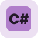

<h3>Hello there! I'm Sid.</h3>
 
I'm a high school student who loves to code and solve problems nobody has. On the web I go by vsenjoyer, because I really love using both Visual Studio 2022 and Visual Studio Code. Kind of a meaningless name, but it's what I chose.

#

<h3> Currently learning: </h3>
<a href="https://vlang.io">V</a>
-
<a href="https://dotnet.microsoft.com/en-us/languages/fsharp">F#</a>
-
<a href="https://redis.com/">Redis</a>

<h3> Skills and Proficiencies: </h3>

